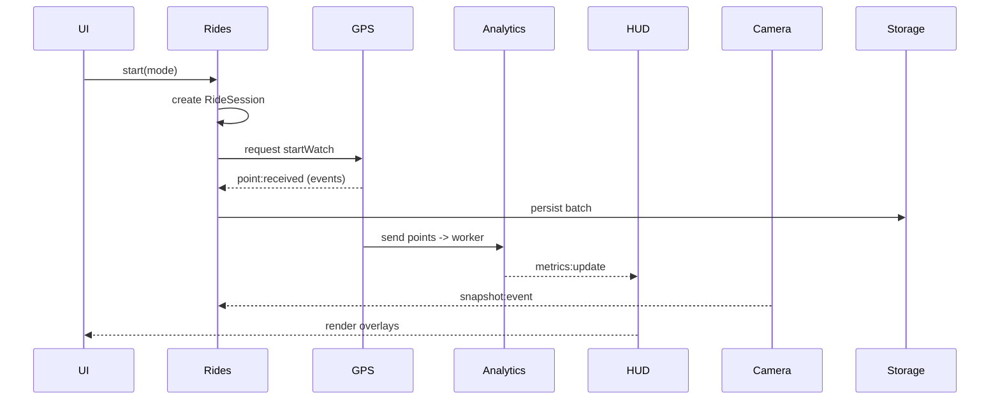

# Frontend Module & Component Map

This document defines the module/component map for the `apps/web` frontend, focusing on modularity, responsibilities, stores, hooks, services, boundaries and communication flows.

Design goals (recap):
- Feature-based modules
- `RideSession` is core entity
- Camera decoupled from GPS
- HUD is a pure reflection layer
- Offline-first (IndexedDB + sync queue)
- Strict TypeScript, minimal coupling, realtime optimized

---

## Top-level module layout (src/modules)

- `gps/` — GPS engine and tracking
- `rides/` — Ride session lifecycle, persistence, summaries
- `camera/` — Camera stream, snapshots, media handling
- `hud/` — HUD rendering components and animations
- `auth/` — Authentication state and user profile
- `safety/` — SOS, danger zones, alerts
- `analytics/` — Metrics, aggregations, workers

Each module follows the same internal structure (recommended):

- components/ — presentational components for the feature
- hooks/ — react hooks (lightweight orchestration, effects)
- services/ — API adapters and device wrappers
- store/ — zustand store slice (or exported selectors)
- types/ — module-specific types (augment shared types)
- utils/ — pure helpers
- tests/ — unit tests

---

## Module definitions

1) gps
- Responsibilities: connect to `navigator.geolocation`, manage `watchPosition`, sanitize/update location points, emit RoutePoint objects, provide low-level geo utils.
- Internal structure:
  - `hooks/useWatchPosition.ts` — lightweight hook to start/stop native watchPosition
  - `services/gps.service.ts` — wrapper around geolocation and worker delegation
  - `store/gps.store.ts` — zustand slice: lastPosition, lastFixAt, status, watchId, history buffer (in-memory ring buffer)
  - `workers/gps.processor.ts` — optional worker for smoothing/filtering
- Stores: `gps.store.ts` (read-heavy; minimal writes)
- Hooks: `useWatchPosition()`, `useLatestPosition()`
- Services: `startWatch()`, `stopWatch()`, `serializePoint()`
- Components: none required other than debug components
- Boundaries: exposes RoutePoint objects; does NOT persist to backend directly; does NOT control RideSession lifecycle
- Dependencies: `utils` (geo math), `types` (RoutePoint)

2) rides
- Responsibilities: own Ride Session lifecycle (create, update, pause, finalize), persist to IndexedDB, coordinate session-level aggregates and sync to backend.
- Internal structure:
  - `store/ride.store.ts` — central ride store (active session, status, metrics, route buffer, snapshots references)
  - `services/storage.service.ts` — IndexedDB wrapper, sync queue, export/import GPX
  - `hooks/useRideSession.ts` — lifecycle orchestration hook used by UI to start/stop sessions
  - `components/SessionController.tsx` — large Start/Stop UI and session controls
- Stores: `ride.store` is authoritative for session object; other modules subscribe to it. It stores minimal in-memory copies and writes batched snapshots to IndexedDB.
- Hooks: `useRideSession()` (start, pause, resume, stop, snapshot)
- Services: `persistSession()`, `enqueueSync()`, `syncWorker` (background)
- Components: `RideSummary`, `SessionController`
- Boundaries: owns RideSession entity and decides what to persist; does not read raw geolocation directly (receives RoutePoint events from `gps` via store/events)
- Dependencies: subscribes to `gps.store` and `camera` snapshot events, depends on `utils` and `types`

3) camera
- Responsibilities: manage `navigator.mediaDevices.getUserMedia()`, provide media stream, capture snapshots, manage facing mode, manage MediaRecorder later.
- Internal structure:
  - `hooks/useCamera.ts` — start/stop stream, flip camera
  - `services/camera.service.ts` — wrapper for getUserMedia, snapshot helpers, safe fallbacks
  - `store/camera.store.ts` — isActive, facingMode, constraints
  - `components/CameraView.tsx` — fullscreen camera container used by Record Mode
- Stores: `camera.store` (availability, active stream id)
- Hooks: `useCamera()` exposes start/stop, takeSnapshot()
- Services: `takeSnapshot() -> Blob | dataURL` and snapshot metadata creation
- Components: `CameraView`, `SnapshotThumbnail`
- Boundaries: must remain decoupled from `gps` — it only emits snapshot events (with optional current coordinates) to `rides` store via a small event API.
- Dependencies: `types` (Snapshot), `utils` for image handling

4) hud
- Responsibilities: render overlays (speed, mini-map, compass, status), animations, and light interactions; no heavy logic.
- Internal structure:
  - `components/` — `Speed`, `MiniMap`, `Compass`, `SessionStatus`, `OverlayContainer`
  - `store/hud.store.ts` — small slice for UI preferences (visible widgets, scale, theme)
  - `hooks/useHudBindings.ts` — map store selectors to components; minimal transformations only
- Stores: `hud.store` only for UI state; HUD reads `gps.store` and `ride.store` via selectors
- Hooks: `useHudBindings()` to assemble props for HUD components
- Services: none; HUD is presentation-only
- Components: `HUDContainer`, `Speed`, `MiniMap`, `Compass`, animation wrappers
- Boundaries: must not compute heavy metrics — rely on `analytics` or `rides` for derived metrics; should not write domain state
- Dependencies: reads `gps`, `rides`, `camera` for data; depends on `ui` package for primitives

5) auth
- Responsibilities: manage authentication state, tokens, user profile and route guarding
- Internal structure:
  - `store/auth.store.ts` — token, user, auth status
  - `services/auth.service.ts` — login, logout, refresh tokens
  - `hooks/useAuth.ts` — convenience hook
  - `components/AuthGuard.tsx` — route protection
- Boundaries: provide identity and tokens to services that need them; do not depend on other modules
- Dependencies: `types` for User

6) safety
- Responsibilities: capture and surface safety events (SOS, manual alerts), store danger zones, subscribe to position to detect geofencing (deferred to backend or later module).
- Internal structure:
  - `store/safety.store.ts` — active alerts, danger zones cache
  - `services/safety.service.ts` — send SOS, fetch danger zones, report incident
  - `components/SOSButton.tsx`, `DangerZonesLayer.tsx`
- Boundaries: safety may listen to `gps` store for geofencing checks, but heavy geospatial calculations can be delegated to `analytics` or backend

7) analytics
- Responsibilities: compute derived metrics (avg speed, calories, elevation gain), perform batch processing using web workers, produce time-series for HUD and summaries.
- Internal structure:
  - `workers/analytics.worker.ts` — heavy calculations (elevation smoothing, calories)
  - `services/analytics.service.ts` — interface to run worker jobs
  - `store/analytics.store.ts` — derived metrics cache and recent history
- Boundaries: read-only for domain state; writes derived metrics into `analytics.store` or pushes updates to `ride.store` in a defined API (batched updates)

---

## Ownership & responsibilities (explicit)

- Ride Session lifecycle owner: `rides` module (authoritative). It creates the `RideSession` entity and persists it.
- Realtime tracking controller: `gps` module is the low-level controller for watchPosition; `rides` subscribes to `gps` updates to append route points.
- HUD rendering owner: `hud` module owns rendering and animation; it consumes state from `gps`, `rides`, and `analytics` via selectors and hooks only.

## How modules communicate

- Primary mechanism: shared Zustand stores + selectors. Each module exposes a small store slice for others to read from. Reads are via selectors to minimize re-renders.
- Event channel: an internal typed event bus for transient events (snapshots, SOS, sync requests). Implement as a tiny pub/sub that uses `EventTarget` or a small RxJS/Subject wrapper. Example events: `point:received`, `snapshot:taken`, `ride:started`, `ride:stopped`, `safety:sos`.
- Services & sync: long-running tasks (storage sync, analytics workers) should be invoked via module services — not direct component calls.

Communication rules:
- Stores are the single source of truth for persistent module state.
- Only `rides` writes the RideSession entity. Other modules may request actions via events or by calling `rides` hooks (`ride.start()`, `ride.addPoint()`, `ride.snapshot()`).
- HUD subscribes to stores; it never mutates domain state.
- Camera emits `snapshot` events with optional positional metadata; `rides` listens and persists snapshot references.

## Stores interaction patterns

- Use modular Zustand stores and compose them using `subscribeWithSelector` (or similar). Keep selectors narrow.
- Avoid cross-writes: module A should never directly mutate module B's store; instead call B's service/hook API or publish an event.
- Example flow: `gps` receives position -> writes to `gps.store` and emits `point:received` with the RoutePoint -> `rides` subscribes to `point:received` and calls `ride.addPoint(point)` (batched writes to `ride.store` and `storage.service`).

## What stays isolated

- Camera implementation details (stream, constraints) stay in `camera` module.
- IndexedDB internals remain inside `rides/services/storage.service.ts`.
- Heavy analytics computations live in `analytics/workers`.

## Offline-first and performance recommendations

- Always write RoutePoints to an in-memory buffer (ring buffer) then flush to IndexedDB in batches (e.g., every 5s or N points).
- Keep HUD renders to reading selectors that map to primitive values (numbers/strings) to minimize re-renders.
- Use Web Workers for smoothing and analytics.
- Keep watchers efficient: `watchPosition` options tuned for 1Hz, highAccuracy configurable by mode.

## Event / Update Flow (text + mermaid)

Sequence (start ride):
1. UI calls `useRideSession().start({ mode })`.
2. `rides` creates `RideSession` in memory, writes initial record to IndexedDB and emits `ride:started`.
3. `gps` starts `watchPosition()`; each fix emits `point:received` and updates `gps.store`.
4. `rides` listens to `point:received`, appends to session route buffer and schedules persistence.
5. `analytics` worker consumes buffered points and emits derived metric updates -> `analytics.store`.
6. `hud` reads from `gps.store`, `ride.store`, and `analytics.store` to render overlays.

Mermaid diagram for the flow:

## Rendering responsibility map

- Map rendering: `gps` provides line and position data; `components/Map` uses `react-leaflet` and reads `gps`/`ride` data to draw route. Map component remains presentational and subscribes to stores.
- HUD rendering: `hud` provides overlay container and individual components; it must avoid heavy layout changes and use CSS transforms for animations.
- Camera view: `camera` owns video element; HUD overlays are layered above the camera container via `HUDContainer` component.

## Module dependency matrix (high-level)

Matrix (A -> B means A depends on B):
- hud -> rides, gps, analytics, ui
- rides -> gps, camera (listens), utils, storage
- gps -> utils, types
- camera -> types
- analytics -> gps, rides (reads buffered data)
- safety -> gps, rides
- auth -> none (others may depend on auth for API calls)

## Final notes & next steps

- The above map keeps RideSession lifecycle inside `rides` and keeps camera decoupled. HUD remains read-only. Use an event bus + module services to keep boundaries clean. Implement typed events and keep workers for heavy tasks.
- Next suggested steps: implement typed event bus, `ride.store` API surface, and `gps` watch hook skeleton (no business logic), then build IndexedDB storage abstractions.

---

Document created by scaffold step. Use this as the canonical frontend architecture reference.
